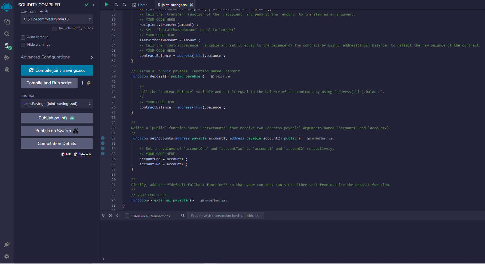
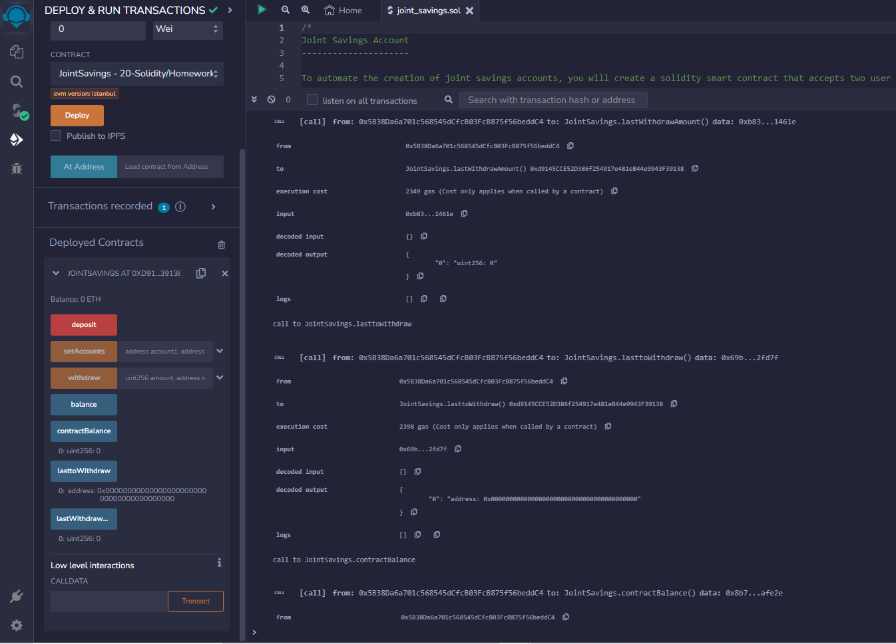

# Joint Savings Account

## **Overview of the Smart Contract**
The Solidity smart contract permits the withdrawl and deposit transactions between two specified adresses on the ethereum blockchain.
****

## **Folder Structure**

* The `joint_savings.sol` contains the solidity smart contract code.
* The `Execution_Results` folder contains snapshots of the process execution of the smart contract on *Remix*.

## **Deploying and Testing the Smart Contract on Remix**
The following presents the step-by-step execution of the smart contract on the *Remix* IDE as the testing platform. Once the contract is successfully compiled and deployed on the ethereum blockcahin, Ether deposits are made into the contract and withdrawls to the addresses are exhibited.

##### 
Figure 1 - Compiling the smart contract

##### 
Figure 2 - Deploying the smart contract

##### 
Figure 3 - Function checks

##### 
Figure 4 - Setting the accounts

##### 
Figure 5 - Deposit 1 ETH

##### 
Figure 6 - Further Deposits

##### 
Figure 7 - Withdraw 5ETH to Account 1

##### 
Figure 8 - Withdraw 10ETH to Account 2

##### 
Figure 9 - Testing the Require Function
